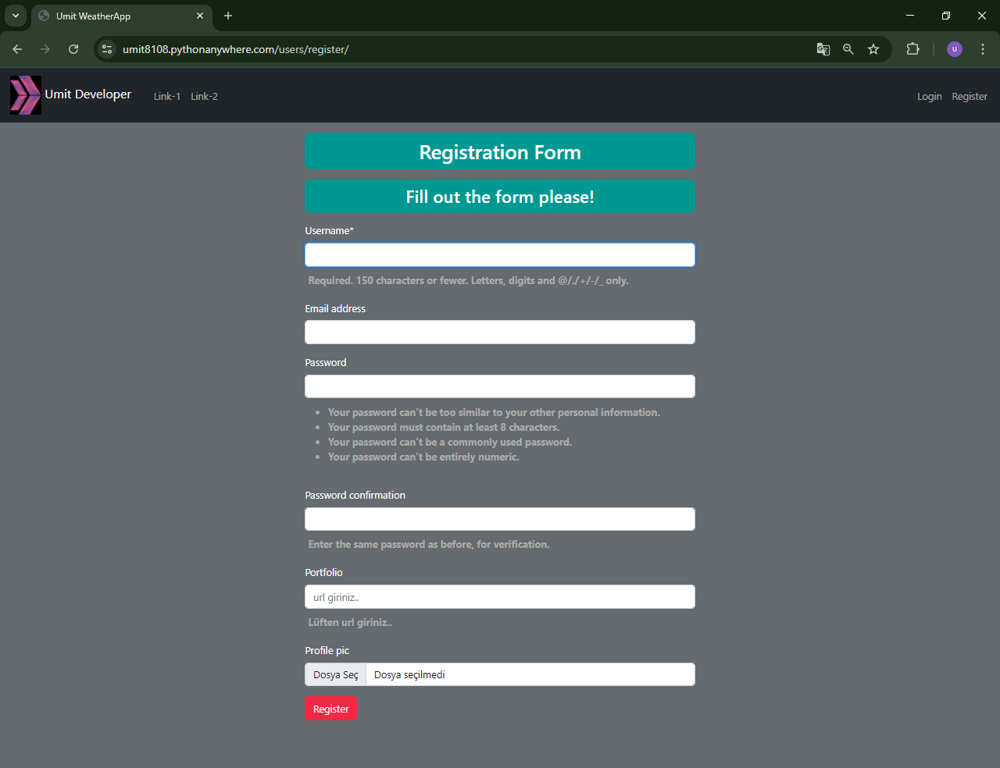
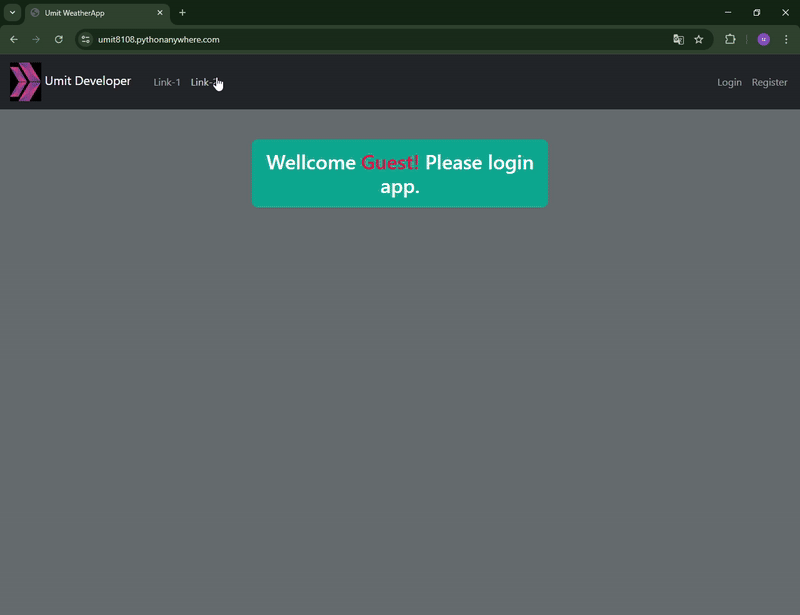

<!-- Please update value in the {}  -->

<h1 align="center">Project_Django_Template_Weather_App</h1>

<p align="center">☁️ Django ile oluşturulmuş ve OpenWeather API'lerini kullanan bir hava durumu uygulaması ☁️</p>


<div align="center">
  <h3>
    <a href="https://umit8108.pythonanywhere.com/">
      Canlı Demo
    </a>
  </h3>
</div>

<!-- TABLE OF CONTENTS -->

## Table of Contents

- [Table of Contents](#table-of-contents)
- [Overview](#overview)
  - [Kullanıcı Kayıt Olma](#kullanıcı-kayıt-olma)
  - [Kullanıcı Login ve Hava Durumu Sorgulama](#kullanıcı-login-ve-hava-durumu-sorgulama)
- [Built With](#built-with)
- [How To Use](#how-to-use)
  - [Test Kullanıcı Bilgileri](#test-kullanıcı-bilgileri)
- [About This Project](#about-this-project)
- [Key Features](#key-features)
- [Contact](#contact)

<!-- OVERVIEW -->

## Overview

### Kullanıcı Kayıt Olma
<!--  -->

➡ Kullanıcıların hava durumu uygulamasına kayıt olma ekranı.

---

### Kullanıcı Login ve Hava Durumu Sorgulama
<!--  -->

➡ Kullanıcıların giriş yapıp şehir adı girerek güncel hava durumu bilgisine ulaştığı ekran.

---


## Built With

<!-- This section should list any major frameworks that you built your project using. Here are a few examples.-->
Bu proje aşağıdaki araçlar ve kütüphaneler kullanılarak geliştirilmiştir:

- [Django Templates](https://docs.djangoproject.com/en/5.1/topics/templates/): Dinamik web sayfaları oluşturmak için.
- [Bootstrap5](https://getbootstrap.com/docs/5.0/getting-started/introduction/): Duyarlı ve modern bir kullanıcı arayüzü sağlamak için.
- [django-crispy-forms](https://django-crispy-forms.readthedocs.io/en/latest/): Formları kolayca stilize etmek için.
- [dj-rest-auth](https://dj-rest-auth.readthedocs.io/en/latest/): Kullanıcı doğrulama ve yetkilendirme modülü.

## How To Use

<!-- This is an example, please update according to your application -->

To clone and run this application, you'll need [Git](https://github.com/Umit8098/Proj_WeatherApp-API-_Temp_Auth-2_email_CH-11_V.04)

When installing the required packages in the requirements.txt file, review the package differences for windows/macOS/Linux environments. 

Complete the installation by uncommenting the appropriate package.

---

requirements.txt dosyasındaki gerekli paketlerin kurulumu esnasında windows/macOS/Linux ortamları için paket farklılıklarını inceleyin. 

Uygun olan paketi yorumdan kurtararak kurulumu gerçekleştirin.

```bash
# Clone this repository
$ git clone https://github.com/Umit8098/Proj_WeatherApp-API-_Temp_Auth-2_email_CH-11_V.04.git

# Install dependencies
    $ python -m venv env
    $ python3 -m venv env (for macOs/linux OS)
    $ env/Scripts/activate (for win OS)
    $ source env/bin/activate (for macOs/linux OS)
    $ pip install -r requirements.txt
    $ python manage.py migrate (for win OS)
    $ python3 manage.py migrate (for macOs/linux OS)

# Create and Edit .env
# Add Your SECRET_KEY in .env file

"""
# example .env;

SECRET_KEY =123456789abcdefg...

# OpenWeather API Ayarları
# API Key to retrieve data from https://openweathermap.org
# Obtained by registration at https://openweathermap.org
API_KEY = {OpenWeather API Anahtarınız}
"""

# Run the app
    $ python manage.py runserver
```

### Test Kullanıcı Bilgileri

Canlı demo için aşağıdaki test kullanıcı bilgilerini kullanabilirsiniz:
- **Kullanıcı Adı**: testuser
- **Şifre**: testpassword123
- **e-mail**: testuser@gmail.com
Bu kullanıcı yalnızca hava durumu sorgulama ve profil güncelleme işlemlerini gerçekleştirebilir.

## About This Project

This project was developed so that users can easily access city-based current weather information. It offers frontend and backend support with its Django Template structure. Accurate and up-to-date data is provided via OpenWeather API.

Users:
- You can access weather information by entering the city name.
- Can view weather histories by registering and logging in.
- Can edit profile information and change passwords.

<hr>

Bu proje, kullanıcıların şehir bazlı güncel hava durumu bilgilerine kolayca erişebilmesi amacıyla geliştirilmiştir. Django Template yapısı ile frontend ve backend desteği sunmaktadır. OpenWeather API ile doğru ve güncel veri sağlanmaktadır.

Kullanıcılar:
- Şehir adı girerek hava durumu bilgisine erişebilir.
- Kayıt olup giriş yaparak hava durumu geçmişlerini görüntüleyebilir.
- Profil bilgilerini düzenleyebilir ve şifre değiştirme işlemleri yapabilir.


## Key Features

- **Şehir Bazlı Hava Durumu Bilgisi**: Kullanıcılar şehir adı girerek güncel hava durumu bilgisine erişebilir.
- **API Desteği**: OpenWeather API ile doğru ve güncel hava durumu verileri sağlanır.
- **Kullanıcı Yönetimi**: Kayıt, giriş, profil düzenleme ve şifre değiştirme işlemleri.
- **Hızlı ve Duyarlı Arayüz**: Bootstrap ile modern ve kullanıcı dostu arayüz.
- **Kullanıcı Bildirimleri**: Başarılı işlemler sonrası kullanıcıya ekran mesajı ile geri bildirim sağlanır.


## Contact

<!-- - Website [your-website.com](https://{your-web-site-link}) -->
- **GitHub** [@Umit8098](https://github.com/Umit8098)

- **LinkedIn** [@umit-arat](https://linkedin.com/in/umit-arat/)
<!-- - Twitter [@your-twitter](https://{twitter.com/your-username}) -->
